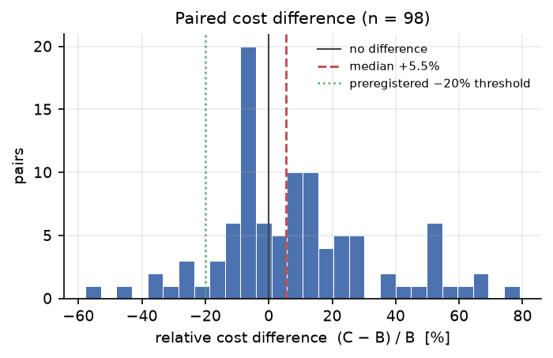
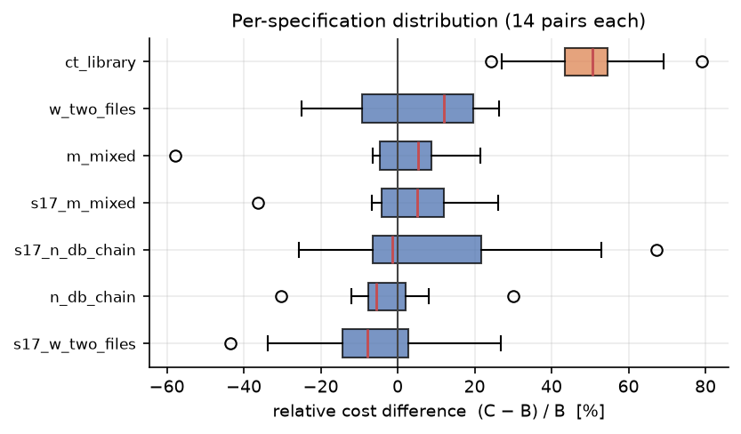
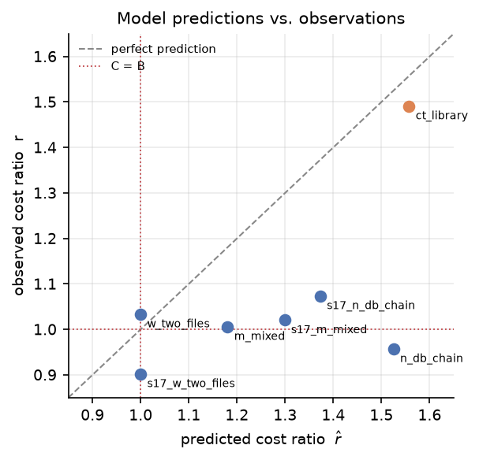

# §6 Evaluation — 結果（ドラフト v0.1）

> 状態: S6 完走後に確定した数値のみを書く。判定は `protocol/`（FROZEN）の規則を
> `analysis/e1_aggregate.py` → `analysis/e2_tests.py` が機械適用した結果である。
> 数値の出所は `analysis/e2_results_main.json`（commit `f54c229`）。
> **部分成立は部分成立のまま書く。スピンしない**（§4 の決定規則）。

## 6.6 実験の実施

| 項目 | 値 |
|---|---|
| 設計 | 7仕様 × 2アーム（B/C）× 14反復 = **196ラン** |
| 成立した対 | **98 / 98**（欠測なし） |
| 除外したペア | **0**（事後の外れ値除外なし。`exclusion_rules` §5） |
| モデル / CLI | `claude-sonnet-5` / `2.1.247` の**単一層**（ドリフトなし） |
| 総費用 | **$121.26**（アームB $58.35 / アームC $62.91） |
| 期間 | 2026-08-28 〜 2026-09-02 |

反復数 N=14 はパイロット（`runs/PILOT_RESULT_2026-08-02.md`）から
事前登録の式で算出した。パイロットの権限は N の決定のみである（§6）。

### 報告しない副次指標（不在の明示）

事前登録 §2 は副次指標として
「トークン内訳・scope_drift・修正サイクル数・write-scope の precision/recall」を挙げ、
**報告のみ・主張の根拠にしない**と定めている。

このうち **scope_drift と write-scope の precision/recall は取得していない。**
宣言された write-scope と実際の書き込みを突き合わせる計装（影git）を
実装しなかったためである（§5.4）。**取得していないので報告しない。**
主要判定（H1〜H4b）はいずれもこれらに依存しないため、判定への影響は無い。

トークン内訳（input / output / cache_read / cache_creation）と
per-turn の軌跡（`num_turns` / `peak_context_tokens` / `turns[]`）は
全 run で取得済みであり、`runs/main/*/*/rep*/calls.jsonl` に含まれる。

## 6.7 主要評価: RQ1（費用）

**H1 は成立しない。しかも予測と符号が逆である。**

| 指標 | 値 |
|---|---|
| 相対差の中央値 (C−B)/B | **+5.5%** |
| 対応付き置換検定 p 値 | 0.0047 |
| BCa 95%CI（対の絶対差・USD） | **[−0.0173, +0.0581]** |
| 有意（p<0.05 かつ CI が0を跨がない） | **不成立** |
| ≥20% 削減 | **不成立** |

置換検定の p 値は α=0.05 を下回るが、**BCa 95%CI が 0 を跨いでいる**。
事前登録は「有意 **かつ** BCa 95%CI が 0 を跨がない」を要求しており（§3 H1）、
後者を満たさない。したがって有意性は主張できない。

p と CI が食い違うのは、有意性を平均、実質性を中央値で判断する設計に由来する
（`PRE_ANALYSIS_DECISIONS.md` 決定B）。**どちらの基準でも H1 は通らない。**
中央値 +5.5% は削減ではなく増加であり、20% 削減の判定以前の問題である。

### 分布

- C が安かった対: **44 / 98（44.9%）** — ほぼ半々
- 相対差の範囲: **−57.8% 〜 +79.1%**
- 総費用では C が **+7.8%**

対単位で見ると効果はほぼ拮抗しており、全体の +5.5% は少数の大きな正値が
引き上げた結果である。

**図1**: 対ごとの相対費用差 (C−B)/B の分布（n=98）。破線が中央値 +5.5%、
点線が事前登録の −20% 閾値。**分布は0を中心にほぼ対称で、閾値は視野の外にある。**

### 仕様別（形状との対応）

| spec | 形状 | B中央 | C中央 | 相対差 中央値 | C が安い対 |
|---|---|---:|---:|---:|---:|
| `s17_w_two_files` | W | 0.5547 | 0.5293 | **−7.9%** | 10/14 |
| `n_db_chain` | N | 0.4323 | 0.4467 | **−5.6%** | 10/14 |
| `s17_n_db_chain` | N | 0.4501 | 0.4790 | −1.4% | 8/14 |
| `s17_m_mixed` | M | 0.7451 | 0.7907 | +5.0% | 5/14 |
| `m_mixed` | M | 0.8054 | 0.8501 | +5.2% | 6/14 |
| `w_two_files` | W | 0.3609 | 0.3722 | +12.1% | 5/14 |
| `ct_library` | **CT** | 0.6617 | 1.0255 | **+50.6%** | **0/14** |

**図2**: 仕様別の分布（各14対）。**`ct_library` だけが0から完全に分離**しており、
他6仕様の箱は0を跨ぐ。

**`ct_library` が突出している。** 相対差 +50.6%、14対すべてで C が高い。
他6仕様は −7.9% 〜 +12.1% の帯に収まっており、この1仕様が全体の符号を決めている。

CT（Contended）は**依存が無いのに write-scope が交差する**形状であり、
レーン方式の代償（過剰直列化）が測れる唯一の仕様として追加した（Amendment A-1）。
その仕様だけが大きな正値を示したことは、**代償が実在し、かつ支配的である**
ことを意味する。W/N/M では代償が構造的にゼロになるため、CT を追加していなければ
この効果は観測できなかった。

## 6.8 共同ゲート: RQ2（時間）

**H2 は成立する。**

| 指標 | 値 |
|---|---|
| median(T_B) | 280.9 s |
| median(T_C) | 292.8 s |
| 比 median(T_C)/median(T_B) | **1.042** |
| 片側CI 上限 | **1.133** |
| マージン δ_time | 1.15 |
| 非劣性 | **成立** |

レーン継続による直列化の遅延は 4.2%（点推定）にとどまり、
CI 上限 1.133 がマージン 1.15 を下回る。

なお `ct_library` は B 254秒 → C 363秒（+43%）と大きく遅く、
`n_db_chain` は 329秒 → 216秒（−34%）と速い。仕様差が大きい。

## 6.9 共同ゲート: RQ3（品質）

**H3 は成立する。**

| 指標 | 値 |
|---|---|
| 受入全通過率 B | **100.0%**（98/98） |
| 受入全通過率 C | **99.0%**（97/98） |
| 差 (C−B) | −1.0 pp |
| 片側90%CI 下限 | **+0.00 pp** |
| マージン δ_q | −10 pp |
| 非劣性 | **成立** |

C 側で落ちたのは `m_mixed` rep5 の1件のみ。CI 下限が 0.00pp であり、
**品質低下の証拠は無い**。ただし小標本（二値・98対）であり、
検出力は高くない（`non_inferiority.md` §3 が想定する状況）。

## 6.10 RQ4(b): コストモデルの端到端検証

**H4b は成立しない。** 過半数条件は満たすが符号一致が破れる。

| spec | 実測 r | 予測 r̂ | 相対誤差 | 許容±25% |
|---|---:|---:|---:|:-:|
| `ct_library` | 1.4909 | 1.5575 | −4.3% | ○ |
| `w_two_files` | 1.0334 | 1.0000 | +3.3% | ○ |
| `s17_w_two_files` | 0.9021 | 1.0000 | −9.8% | ○ |
| `m_mixed` | 1.0060 | 1.1806 | −14.8% | ○ |
| `s17_m_mixed` | 1.0205 | 1.2987 | −21.4% | ○ |
| `s17_n_db_chain` | 1.0736 | 1.3730 | −21.8% | ○ |
| `n_db_chain` | 0.9571 | 1.5251 | **−37.2%** | ✕ |

- **大きさ**: 7仕様中 **6仕様**が ±25% 以内。過半数（4以上）の条件は満たす。
- **符号**: モデルは全仕様で r>1（C が高い）と予測したが、実測では
  `n_db_chain`（0.957）と `s17_w_two_files`（0.902）の**2仕様で C が安い**。
  事前登録は**全仕様での符号一致**を要求しており（§3 H4(b)）、不成立。

**図3**: 予測 r̂ と実測 r。破線が完全予測、点線が C=B の境界。
**7点すべてが破線の下側にある**（実測 < 予測）。左下の2点は
実測が C=B の線を下回っており、符号が予測と逆になった仕様である。

**誤差の向きが揃っている。** 7仕様すべてで実測 < 予測（−37.2% 〜 +3.3%、
6仕様が負）。モデルは C の不利を**系統的に過大評価**している。
これは偶然の散らばりではなく、モデルに構造的な偏りがあることを示す。
`§3.7` の縮退先に従い、これはモデルの適用限界として §8 に記載する。

## 6.11 中心主張の判定

事前登録の決定規則（§4）は、中心主張
「レーン継続は品質・時間を実質犠牲にせず費用を ≥20% 削減する」を掲げられるのは
**RQ1有意 ∧ ≥20%削減 ∧ RQ2成立 ∧ RQ3成立** のときのみ、と定める。

| ゲート | 結果 |
|---|---|
| RQ1 有意 | **✕** |
| RQ1 ≥20%削減 | **✕**（符号が逆） |
| RQ2 時間の非劣性 | ○ |
| RQ3 品質の非劣性 | ○ |

**中心主張は掲げられない。** 部分成立をそのまま報告する。

言えることは次の形になる。

> レーン継続は、時間と品質を実質的に犠牲にしない（H2・H3 とも非劣性成立）。
> しかし費用を削減しない。本実験の条件下では中央値で 5.5% 高く、
> 削減の有意性も示されなかった。

**「遅くも粗くもならないが、安くもならない」** というのが本実験の結論である。
